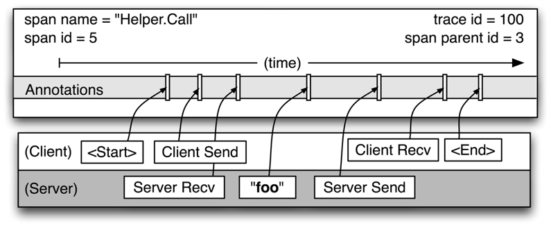

# Dapper

## 1. Ý tưởng
Dapper được xây dựng dựa trên 2 mục đích cơ bản: sử dụng phổ biến và quản lý liên tục. Việc được sử dụng phổ biến rất quan trọng bởi vì sự hiệu quả của cơ sở hạ tầng theo dõi sẽ bị ảnh hưởng nếu một phần nhỏ của hệ thống không được quản lý. Thêm vào đó, việc quản lý cần phải được duy trì bởi vì sẽ có một vài thời điểm mà chúng ta không thể đoán được cách hệ thống vận hành và tái hiện quá trình đó. Từ 2 mục đích trên, Dapper phải đáp ứng được 3 yêu cầu tất yếu:

### 1.1. Chi phí thấp (low overheads):
Hệ thống theo dõi không nên có bất cứ ảnh hưởng nào đến sự vận hành của dịch vụ đang thực thi. Trong một số dịch vụ đã được tối ưu hoá đến mức tối đa, kể cả một tiến trình quản lý rất nhỏ vẫn sẽ dễ dàng nhận thấy và kết quả là deployment team sẽ loại bỏ nó.

### 1.2. Application-level transparency:
Hệ thống quản lý sẽ khó có thể bị nhận ra bởi những người lập trình ứng dụng. Một hệ thống quản lý được xây dựng dựa trên việc kết hợp trực tiếp ở tầng ứng dụng sẽ trở nên cực kỳ mỏng manh. Sử bỏ xót hay là bug sẽ thường xuyên diễn ra, từ đó làm ảnh hưởng đến tính phổ biến mà Dapper đang hướng tới.

### 1.3. Có khả năng mở rộng (Scalability):
Hệ thống này cần phải quản lý được khối lượng dịch vụ cực lớn của Google hiện nay và clusters cho ít nhất là vài năm nữa.

Một yêu cầu nữa cũng đáng chú ý là dữ liệu sau khi được “tracing” phải được sẵn sàng để mang đi sử lý ngay sau khi được tạo ra: lý tưởng nhất là trong vòng 1 phút.
## 2. Cách cài đặt
Dapper có thể theo dõi đường quản lý phân tán mà gần như không có sự can thiệp nào từ những người phát triển ứng dụng bằng cách phụ thuộc hầu hết vào một số thư viện phổ biến: 
* Khi một luồng xử lý một “traced control path”, Dapper đặt một ngữ cảnh theo dõi vào lưu trữ nội bộ của luồng. Ngữ cảnh theo dõi là một bộ chứa nhỏ, dễ dàng copy của những tính chất của một nhịp như là “trace” hoặc “span ids”
* Khi việc tính toán được làm không đồng bồ, phần lớn lập trình viên của Google sử dụng một thư viện quản lý “flow” để xây dựng callbacks và lên kế hoạch nó trong một “thread pool” và trong những “executor” khác. Dapper đản bảo rằng tất cả những hàm callbacks đó lưu lại trace context của tiến trình tạo ra nó, trace context này lại liên quan đến luồng thích hợp khi hàm callbacks được thực thi. Bằng cách này, Dapper ids sử dụng để xây dựng lại trace có khả năng theo dõi control paths không đồng bộ một cách thầm lặng. 
* Hầu hết việc trao đổi thông tin nội bộ trong một process của Google được xây dựng dựa trên một RPC framework và “bindings” trong C++ và Java. Và framework này sẽ định nghĩa “spans” theo những RPCs khác. Span và trace ids sẽ được truyền từ client đến server cho RPC theo dõi. Những hệ thống dựa trên RPC như vậy đang được sử dụng rộng rãi tại Google. 

## 3.Tổ chức dữ liệu
We model Dapper traces using trees, spans, and annotations. In a Dapper trace tree, the tree nodes are basic units of work which we refer to as spans. The edges indicate a casual relationship between a span and its parent span. Independent of its place in a larger trace tree, though, a span is also a simple log of timestamped records which encode the span’s start and end time.
Figure below provides a more detailed view of the logged events in a typical Dapper trace span. This particular span describes the longer of the two “Helper.Call” RPCs. Span start and end times as well as any RPC timing information are recorded by Dapper’s RPC library instrumentation. If application owners choose to aug- ment the trace with their own annotations (like the “foo” annotation in the figure), these are also recorded with the rest of the span data. 
It is important to note that a span can contain informa- tion from multiple hosts; in fact, every RPC span con- tains annotations from both the client and server pro- cesses, making two-host spans the most common ones. Since the timestamps on client and server come from  a detailed view of a single span from different host machines, we have to be mindful of clock skew. In our analysis tools, we take advantage of the fact that an RPC client always sends a request before a server receives it, and vice versa for the server response. In this way, we have a lower and upper bound for the span timestamps on the server side of RPCs. 

The Dapper trace logging and collection pipeline is a three-stage process. First, span data is written (1) to local log files. It is then pulled (2) from all  production hosts by Dapper daemons and collection in- frastructure and finally written (3) to a cell in one of sev- eral regional Dapper Bigtable repositories. A trace is laid out as a single Bigtable row, with each column corresponding to a span. Bigtable’s support for sparse table layouts is useful here since individual traces can have an arbitrary number of spans. The median latency for trace data collection – that is, the time it takes data to propagate from instrumented application binaries to the central repository – is less than 15 seconds. The 98th per- centile latency is itself bimodal over time; approximately 75% of the time, 98th percentile collection latency is less than two minutes, but the other approximately 25% of the time it can grow to be many hours. 

## 4. Đánh giá
* Perhaps the most critical part of Dapper’s code base is the instrumentation of basic RPC, threading and control flow libraries, which includes span creation, sampling, and logging to local disks. Besides being lightweight, this code needs to be stable and robust since it is linked into a vast number of applications, making maintenance and bug fixing difficult. The core instrumentation is less than 1000 lines of code in C++ and under 800 lines in Java. The implementation of key-value annotations adds an additional 500 lines of code. 
* Dapper penetration can be assessed in two dimensions: the fraction of production processes that can generate Dapper traces (i.e., those that are linked with Dapper- instrumented runtime libraries) and the fraction of pro- duction machines running Dapper’s trace collection dae- mon. Dapper’s daemon is part of our basic machine image, making it present on virtually every server at Google. It is difficult to determine the precise fraction of Dapper-ready processes since processes generating no trace information are invisible to Dapper. However, given how ubiquitous Dapper-instrumented libraries are, we estimate that nearly every Google production process supports tracing. 
* There are cases where Dapper is unable to follow the control path correctly. These typically stem from the use of non-standard control-flow primitives, or when Dap- per mistakenly attributes causality to unrelated events. Dapper provides a simple library to help developers control trace propagation manually as a work-around. 

