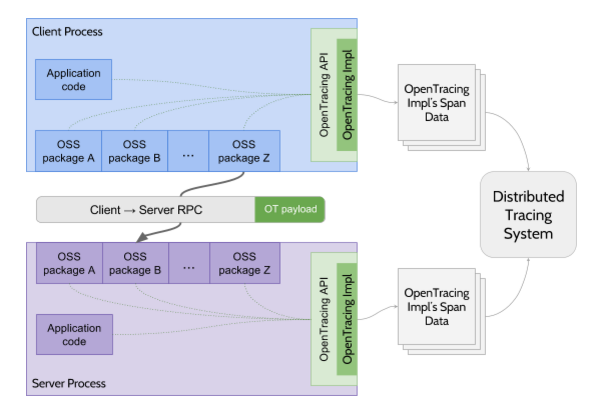

# Tìm hiểu về OpenTracing

## 1.Lịch sử
Các nhóm lập trình và các tổ chức vẫn đang dần chuyển đổi từ việc sử dụng những hệ thống cũ, lớn sang việc sử dụng mô hình kiến trúc microservice hiện đại. Họ làm như vậy vì nhiều lý do thuyết phục: các thành phần của hệ thống có thể mở rộng một cách độc lập, các nhóm lập trình nhỏ và linh hoạt, việc triển khai được thực hiện liên tục và không bị phụ thuộc lẫn nhau.
Điều đó cho thấy khi một hệ thống có lượng truy cập lớn hoặc được chia tách thành nhiều dịch vụ, các nhiệm vụ quan trọng sẽ trở nên khó khăn hơn: tối ưu hóa độ trễ người dùng, phân tích và tìm nguyên nhân xảy ra lỗi, kết nối các phần riêng biệt của hệ thống.
Các hệ thống truy vết hiện tại (Zipkin,Dapper, HTrace, X-Trace….) được sinh ra nhằm giải quyết những vấn đề trên bằng cách thêm công cụ truy vết vào tầng ứng dụng bằng việc sử dụng những API không tương thích. Các nhà phát triển sẽ cảm thấy khó khăn khi phải tìm một công cụ truy vết để sử dụng cho một hệ thống có nhiều ngôn ngữ lập tình của họ, tuy nhiên những APIs của công cụ truy vết tầng ứng dụng này cũng có những ý nghĩa và công dụng nhất định của nó.
OpenTracing: bằng cách cung cấp các APIs thống nhất, nhanh gọn cho hầu hết các nền tảng phổ biến. OpenTracing giúp các nhà phát triển thêm (hoặc chuyển đổi) truy vết một cách dễ dàng.

## 2.OpenTracing API
OpenTracing chỉ định nghĩa API thông qua đó những công cụ ở ứng dụng có thể đữa dữ liệu vào một truy vết có thể tích hợp được. Nhìn chung thì OpenTracing không đảm bảo về cách dữ liệu sẽ được xử lý bởi một vết cơ bản. Vì vậy, vấn đề đặt ra là loại dữ liệu nào nên được cũng nên được cung cấp cho các API để đảm bảo tốt nhất khả năng tương thích giữa các tracer.

## 3. Các client được hỗ trợ cùng với các ngôn ngữ.
- Go [(opentracing-go)](https://github.com/opentracing/opentracing-go)
- Python [(opentracing-python)](https://github.com/opentracing/opentracing-python)
- Javascript [(opentracing-javascript)](https://github.com/opentracing/opentracing-javascript)
- Java [(opentracing-java)](https://github.com/opentracing/opentracing-java)
- C# [(opentracing-csharp)](https://github.com/opentracing/opentracing-csharp)
- Objective-C [(opentracing-objc)](https://github.com/opentracing/opentracing-objc)
- C++ [(opentracing-cpp)](https://github.com/opentracing/opentracing-cpp)
- Ruby [(opentracing-ruby)](https://github.com/opentracing/opentracing-ruby)
- PHP (sắp tới)

## 4. Những project đang tương thích Opentracing
* Zipkin: hỗ trợ nhiều ngôn ngữ như [Brave(Zipkin Java)](https://github.com/openzipkin/brave-opentracing) đến [Zipkin-go-opentracing](https://github.com/openzipkin/zipkin-go-opentracing).
* Jaeger: là một hệ thống truy tìm phân tán của Uber, được xây dựng từ OpenTracing từ khi bắt đầu, Jaeger bao gồm các client một số ngôn ngữ như [Java](https://github.com/uber/jaeger-client-java), [Go](https://github.com/uber/jaeger-client-go), [Python](https://github.com/uber/jaeger-client-python), [Node.js](https://github.com/uber/jaeger-client-node).
* Appdash: là một hệ thống do tìm phân phối dựa trên Golang-based, ban đầu đưuọc phát triển và có nguồn mở từ sourcegraph. Opentracing sử dụng Appdash như một phụ trợ.
* LightStep: tương thích với Opentracing dành cho Go, Python, Javascript, Objective-C, Java,PHP, Ruby và C++.
* Hawkular:  hỗ trợ client [Java](https://github.com/hawkular/hawkular-client-java), [Go](https://github.com/hawkular/hawkular-client-go), [Ruby](https://github.com/hawkular/hawkular-client-ruby), [Python](https://github.com/hawkular/hawkular-client-python).
* Sky-walking: hỗ trợ client Java.

## 5. OpenTracing software architecture
Dấu vết trong OpenTracing được xác định một cách ngầm định bởi spans của chúng. Cụ thể:
* Một truy vết có thể được xem như là một đồ thị có hướng không chu trình (Directed Acyclic Graph) của spans, trong đó các cạnh giữa các spans được gọi là references.
* Một span đại diện cho một tiến trình được gọi trong yêu cầu nói trên, nó có chứa thông tin về tên tiến trình, thời gian bắt đầu, kết thúc, định danh của span v.v.



## 6. Data model của OpenTracing
Hai khía cạnh cơ bản thực hiện OpenTracing trên cơ sở hạ tầng là Spans và Relationships:
### 1. Các spans là các đơn vị hợp lý của công việc trong một hệ thống phân phối và theo định nghĩa tất cả chúng đều có tên, thời gian bắt đầu và một khoảng thời gian. Trong một dấu vết, các khoảng được kết hợp với các hệ thống phân phối đã tạo ra chúng.


* Relationships là các kết nối giữa các Span có thể không có hoặc nhiều hơn. Các kết nối giữa Spans giúp mô tả ngữ nghĩa của hệ thống đang chạy, cũng như con đường quan trọng cho các giao dịch nhạy cảm với độ trễ.


* **ChildOf**: Một span có thể là 'ChildOf' của một span cha, span cha phụ thuộc vào span con một phần nào đó. Các ví dụ sau có thể có mối quan hệ 'ChildOf':
* Một span biễu diễn RPC (Remote procedure call) ở phía server có thể là 'ChildOf' của span biểu diễn RPC đó ở phía client.
* Một span biểu diễn câu lệnh ghi SQL (Structured query language) có thể là 'ChildOf' của span biểu diễn phương thức lưu trữ ORM (Object-relational mapping).

```
Dưới đây có thể là biểu đồ thời gian của mối quan hệ 'ChildOf'
 [-Parent Span---------]
         [-Child Span----]

    [-Parent Span--------------]
         [-Child Span A----]
          [-Child Span B----]
        [-Child Span C----]
         [-Child Span D---------------]
         [-Child Span E----]
```

* **FollowsFrom**: Một vài span cha không hề phụ thuộc vào kết quả của span con, ở trường hợp như vậy chúng ta nói span con 'FollowsFrom' span cha. 

```
Dưới đây có thể là biểu đồ thời gian của mối quan hệ 'FollowsFrom'
   [-Parent Span-]  [-Child Span-]


    [-Parent Span--]
     [-Child Span-]


    [-Parent Span-]
                [-Child Span-]
```

### 2. Mối quan hệ giữa spans và một truy vết

```
        [Span A]  ←←←(the root span)
            |
     +------+------+
     |             |
 [Span B]      [Span C] ←←←(Span C is a `ChildOf` Span A)
     |             |
 [Span D]      +---+-------+
               |           |
           [Span E]    [Span F] >>> [Span G] >>> [Span H]
                                       ↑
                                       ↑
                                       ↑
                         (Span G `FollowsFrom` Span F)
```

Truy vết còn thế thể được biểu thị sử dụng trục đồ thị thời gian như biểu đồ dưới đây:

```
Mối quan hệ tạm thời giữa các spans trong một truy vết

––|–––––––|–––––––|–––––––|–––––––|–––––––|–––––––|–––––––|–> time

 [Span A···················································]
   [Span B··············································]
      [Span D··········································]
    [Span C········································]
         [Span E·······]        [Span F··] [Span G··] [Span H··]
```
## 6. References
[Opentracing documentation](http://opentracing.io/documentation/)