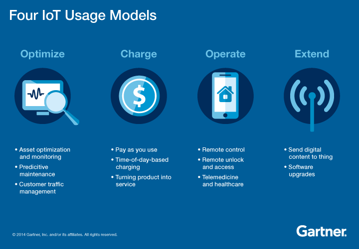

# IoT at a glance

## 1. Định nghĩa

IoT, theo ITU (International telecommunication union) và IERC (IoT European Research Cluster) định nghĩa như là một mạng lưới cơ sở hạ tầng trên toàn cầu và mang tính linh động, có khả năng tự cấu hình dựa trên những giao thức giao tiếp có khả năng trao đổi thông tin, sử dụng thông tin, kết hợp và theo tiêu chuẩn. Tại những giao thức giao tiếp này, tất cả những vật chất thật và ảo đều có danh tính, tính chất thật và tính cách ảo; chúng có và sử dụng giao diện thông minh, liên tục được tích hợp vào mạng lưới thông tin.

## 2. Mục đích

### 2.1. Trong công việc
#### 2.1.1. Thu thập và xử lý thông tin
+ Theo dõi hành vi: các công ty có thể theo dõi vị trí hay người dung tương tác như thế nào với sản phẩm của họ để đưa ra những quyết định đúng. VD như một vài công ty xe hơi dựa vào bộ phận cảm biến và định vị để thu thập thông tin và từ đó đưa ra những cải tiến cho mẫu xe mới. hoặc những công ty bảo hiểm cũng có thể dựa vào để chi trả cho thiệt hại của chiếc xe.
+ Cải hiện việc nhận thức hình huống: dữ liệu từ những thiết bị cảm biến được tích hợp vào cơ sở hạ tầng (toà nhà, đường phố) cho biết những thông tin về độ ẩm, mực nước biển, nhiệt độ, huướng gió, bằng việc phân tích những thông tin đó, con người có thể đưa ra những dự báo, cảnh vào về những sự kiện đang, sắp xảy ra cùng với sự giúp đỡ của máy tính.
+ Phân tích quyết định hướng cảm biến: IoT cũng có thể hỗ trợ trong việc con người lên kế hoạch, đưa ra quyết định cho những vấn đề phức tạp. Trong những năm tiếp theo, ngành công nghiệp khai thác dầu mỏ có thể dựa vào những thông tin có được từ những cảm biến mà có thể tìm được chính xác vị trí của những túi dầu, không như việc sử dụng hướng dữ liệu như bây giờ.

### 2.1.2. Tự động hoá và điều khiển
Một trong những quá trình quan trọng trong việc phát triển tự động hoá và điều khiển là làm ra những dữ liệu cơ bản để máy móc, thiết bị dựa vào đó có thể hoạt động một cách bình thường, ổn định. Công việc đó cũng có nghĩa là biến đổi những dữ liệu thu thập, phân tích từ  IoT thành những chỉ dẫn thông qua mạng lưới thông tin để đến với thiết bị truyền động của thiết bị.
+ Tối ưu hoá quá trình: IoT đã đang mở ra một ranh rới mới trong việc nâng cấp quá trình trong công nghiệp. Trong một số ngành, đơn cử như ngành công nghiệp hoá chất, những cảm biến được đặt ở khắp mọi nơi, đưa dữ liệu vào máy tính để phân tích, từ đó có thể đảm bảo được tỉ lệ các chất được cho vào, nhiệt độ, áp suất là đúng với công thức, quy trình.
+ Tối ưu hoá quá trình tiêu thụ tài nguyên: từ những cảm biến lắp đặt trong toà nhà, số liệu được đưa vào máy tính để điều chỉnh việc tiêu thụ tài nguyên.
+ Những hệ thống tự động phức tạp: một trong những mục đích sử dụng cao nhất của IoT bao gồm việc giúp máy tính đưa ra những quyết định khó, phưcs tạp, một cách tức thì và liên tục của những vấn đề không đoán trước được trong tương lai sao cho gần giống với con người nhất có thể. Trong ngành công nghiệp ô tô, đã có nhiều loại ô tô có thể nhận biết được chướng ngại vật sắp gặp phải và đưa ra quyết định thay cho lái xe một cách chính xác. 

### 2.2. Trong cuộc sống
Sự ra đời của IoT có lẽ đã phá vỡ những cách mà chúng ta vẫn đang sống và làm việc. Trong phần này sẽ đề cập tới phần “cuộc sống”. Có lẽ cụm từ smarthomes không còn xa lạ với đại đa số con người hiện nay. Smarthome là tập hợp tất cả những thiết bị được kết nối với nhau để giúp chúng ta có một cuộc sống dễ dàng hơn, thoải mái hơn.
Trong những năm tiếp theo, smarthomes sẽ vẫn tiếp tục bùng nổ do sự giảm giá của thiết bị IoT cùng với việc công chúng sẽ dần nhận ra được những ích lợi mà những thiết bị này mang lại. Sau smarthomes, có lẽ cụm từ smartcities, smartcountries sẽ xuất hiện, đưa IoT lên một tầm cao mới. Smarthomes chỉ là một phần rất nhỏ trong những thay đổi mà IoT mang lại đối với cuộc sống con người.

## 3. Mô hình sử dụng

## 4. Đặc điểm của IoT
Một số đặc điểm chung và quan trọng là:
### 4.1. Sự thông minh
IOT đi kèm với sự kết hợp các thuật toán và tính toán, phần mềm và phần cứng làm cho nó thông minh.
### 4.2. Khả năng kết nối.
Kết nối cho Internet of Things bởi các vật dụng hàng ngày. Khả năng kết nối của các đối tượng này là quan trọng bởi vì cấp độ tương tác đối tượng đơn giản đóng góp trí tuệ tập thể trong mạng IOT. Nó cho phép tiếp cận mạng và tính tương thích trong những điều. Với kết nối này, các cơ hội thị trường mới cho Internet thứ có thể được tạo ra bởi các mạng của sự vật thông minh và các ứng dụng.
### 4.3. Tính năng động
Các hoạt động chính của Internet of Things là để thu thập dữ liệu từ môi trường của nó, điều này đạt được với những thay đổi năng động diễn ra xung quanh thiết bị. Các trạng thái của các thiết bị tự động thay đổi, ví dụ ngủ và thức dậy, kết nối và / hoặc bị ngắt kết nối cũng như bối cảnh của các thiết bị bao gồm nhiệt độ, vị trí và tốc độ. Ngoài tình trạng của thiết bị, số lượng thiết bị cũng thay đổi năng động với một người, địa điểm và thời gian.
### 4.4. Quy mô lớn
Số lượng thiết bị cần phải được quản lý và giao tiếp với nhau sẽ lớn hơn nhiều so với các thiết bị kết nối Internet hiện tại. Việc quản lý các dữ liệu được tạo ra từ các thiết bị và giải thích của họ cho mục đích ứng dụng trở nên quan trọng hơn. Gartner (2015) khẳng định quy mô khổng lồ của IOT trong báo cáo ước tính mà nó nói rằng 5,5 triệu những điều mới sẽ có được kết nối mỗi ngày và 6,4 tỷ thứ kết nối sẽ được sử dụng trên toàn thế giới vào năm 2016, đó là tăng 30 phần trăm từ năm 2015. Các báo cáo cũng dự báo rằng số lượng các thiết bị kết nối sẽ đạt 20,8 tỷ vào năm 2020.
### 4.4. Cảm biến
IOT sẽ không được tốt mà không có cảm biến sẽ phát hiện hoặc đo bất kỳ thay đổi trong môi trường để tạo ra dữ liệu có thể báo cáo về tình trạng của họ hoặc thậm chí tương tác với môi trường. công nghệ cảm biến cung cấp các phương tiện để tạo ra khả năng phản ánh một nhận thức thực sự của thế giới vật chất và con người trong đó. Các thông tin viễn chỉ đơn giản là tín hiệu tương tự đầu vào từ thế giới vật chất, nhưng nó có thể cung cấp sự hiểu biết phong phú của thế giới phức tạp của chúng tôi.
### 4.5. Tính đồng nhất
Không đồng nhất trong Internet of Things là một trong những đặc điểm quan trọng.Thiết bị trong IOT được dựa trên nền tảng phần cứng khác nhau và các mạng và có thể tương tác với các thiết bị khác hoặc các nền tảng dịch vụ thông qua các mạng khác nhau. kiến trúc IOT nên hỗ trợ kết nối mạng trực tiếp giữa các mạng không đồng nhất. Các yêu cầu về thiết kế quan trọng cho những thứ không đồng nhất và môi trường của họ trong IOT là scalabilities dạng modul mở rộng và khả năng tương tác.
### 4.6. Tính bảo mật
Thiết bị IOT tự nhiên dễ bị tổn thương các mối đe dọa an ninh. Như chúng ta đã đạt được hiệu quả, kinh nghiệm mới lạ, và các quyền lợi khác từ IOT, nó sẽ là một sai lầm để quên đi mối quan tâm an ninh liên kết với nó. Có một mức độ cao về vấn đề minh bạch và sự riêng tư với IOT. Điều quan trọng là để đảm bảo các thiết bị đầu cuối, mạng lưới, và các dữ liệu được truyền qua tất cả của nó có nghĩa là tạo ra một mô hình an ninh.
## 5. Lĩnh vực sử dụng IoT

## 6. References
[realyze.in](https://realyze.in/downloads/TheInternetofThings.pdf)

[businessinsider.com](http://www.businessinsider.com/internet-of-things-smart-home-automation-2016-8)

[iot-analytics.com](https://iot-analytics.com/top-10-iot-project-application-areas-q3-2016/)

